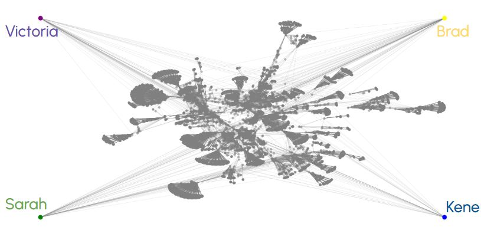
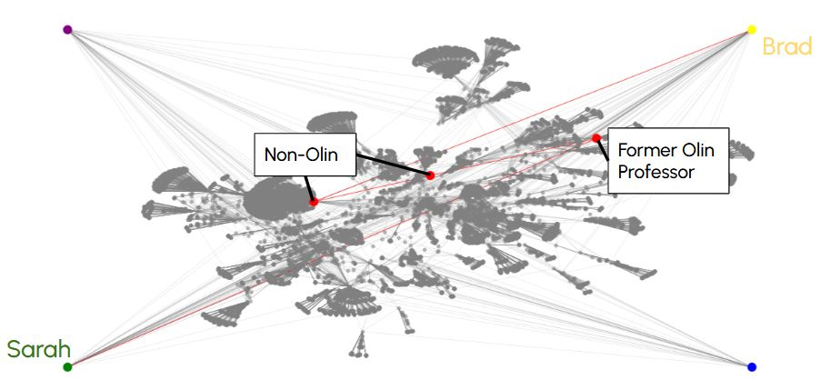

# Research Author Network

> Discrete Mathematics Course Project | Members: Eleane, Ellen, Vivian

## Overview

This project builds a research author collaboration network from Semantic Scholar API data to analyze how researchers interact _within_ and _across_ research areas. In this framework, individual researchers are represented as nodes, while co-authorship relationships form the edges connecting them. Edge weights correspond to the number of shared publications between two researchers, capturing the strength of their collaboration. As students attending Franklin W. Olin College of Engineering, we specifically wanted to take a closer look and apply this to our professors.

The overarching goal is to characterize academic collaboration along two dimensions: (1) interactions within a single research area, and (2) interactions across different research areas. To study within-area collaboration, we identify densely connected groups of researchers using the Bron–Kerbosch algorithm, a recursive backtracking approach for finding all maximal cliques in an undirected graph. These cliques represent tightly coupled collaboration communities in which every researcher has directly co-authored with all others in the group.

To analyze interactions across research areas, we construct a global collaboration graph (adjacency matrix) using a depth-2 expansion, consisting of a researcher, their direct collaborators, and collaborators-of-collaborators. This produces a network of approximately 17,000 researchers. For this analysis, the weighted collaboration graph is abstracted to a binary adjacency matrix, where an edge indicates the existence of at least one collaboration. Shortest paths between arbitrary pairs of researchers are then computed using Dijkstra’s algorithm, revealing indirect collaboration chains that link researchers across different areas.

## Visuals

Below are some examples of level of connectivity between researchers (professors at Olin College).

## Supporting Documents
- [Final Presentation Slides](https://docs.google.com/presentation/d/1oJGapH64HUfconQeI0Dbsks-0ZWj_1nlFtQGEyYJGQQ/edit?slide=id.g3917892435e_0_0#slide=id.g3917892435e_0_0)
- [Annotated Bibliography](https://docs.google.com/document/d/1vR8ULJJfhnNDBQdim_4WWOl5AeWYMzZ4XShRFwyTUUA/edit?tab=t.0)